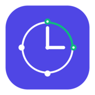

# ⏰ Shift Clock

  

**Shift Clock** es una aplicación de gestión de alarmas avanzada diseñada específicamente para resolver las problemáticas de horarios rotativos y turnos irregulares. 

Las aplicaciones de reloj y alarmas convencionales están pensadas para personas con rutinas fijas de lunes a viernes. Sin embargo, ¿qué ocurre si trabajas a turnos, tienes guardias de 24 horas, o ciclos de descanso que no coinciden con los fines de semana? Reprogramar manualmente las alarmas cada semana es propenso a errores humanos que pueden costar muy caros. **Aquí es donde entra Shift Clock.**

## 🎯 ¿Para quién es Shift Clock?

Shift Clock ha sido creado pensando en profesionales con horarios atípicos que requieren una programación de sueño flexible y cíclica:

- 🏥 **Personal Sanitario:** Médicos, enfermeros, técnicos y celadores con guardias rotativas complejas.
- ✈️ **Pilotos y Tripulantes de Cabina:** Profesionales de la aviación con horarios variables y necesidades de descanso estrictas.
- 🚒 **Equipos de Salvamento, Emergencias y Seguridad:** Bomberos, policías, militares y equipos de rescate con ciclos de trabajo específicos (ej. 2 días de trabajo y 4 de descanso).
- 🏢 **Funcionarios y Trabajadores a Turnos:** Operarios de fábricas y personal que rota entre turnos de mañana, tarde y noche periódicamente.

## ✨ Características Principales

- 🔄 **Alarmas por Patrones Cíclicos (¡Nuestra especialidad!):** Configura alarmas basadas en tus ciclos de trabajo. Solo necesitas definir la fecha de inicio de tu turno, cuántos días seguidos trabajas y cuántos descansas. Shift Clock proyectará el calendario hacia el futuro y activará la alarma únicamente en tus días laborables, de manera totalmente automática.
- 📅 **Alarmas Semanales Clásicas:** Si tu horario vuelve a la normalidad, también puedes configurar días fijos de la semana.
- 🔊 **Despertar Suave (Volumen Progresivo):** El volumen comenzará muy bajo e irá incrementándose gradualmente para garantizar un despertar menos brusco y más natural.
- 📳 **Control Total de Vibraciones:** Personaliza si deseas que tu dispositivo vibre de forma general o escoge ajustes individuales por alarma.
- ⏱️ **Utilidades Extra (Cronómetro y Temporizador):** Herramientas de tiempo completas. El temporizador cuenta con una alarma insistente e ininterrumpida que no se detendrá hasta que lo decidas.
- 🌍 **Soporte Multilenguaje:** Interfaz traducida nativamente al Español, Inglés, Alemán, Francés, Italiano y Portugués, adaptándose automáticamente al idioma de tu móvil.
- 🎨 **Diseño Moderno (Material You):** Una interfaz intuitiva, con colores vibrantes y de alto contraste basada en Material Design 3 de Android 14.

## 🛠️ Aspectos Técnicos

- **Lenguaje:** Kotlin
- **UI:** Jetpack Compose con animaciones fluidas
- **Base de Datos:** Room Database con migraciones automáticas seguras
- **Asincronía:** Kotlin Coroutines & Flow

## 🧑‍💻 Información del Proyecto

- **Desarrollador:** Roberto J.
- **Empresa:** aipp.es
- **Email de contacto:** rj@aipp.es
- **Versión actual:** 1.0.0
- **Licencia:** ShiftClock Versión 1.0.0 Copyright © 2026 Roberto J. Todos los derechos reservados.

---
*Construido para que tú solo te preocupes de descansar bien; de despertarte a tu hora, ya se encarga Shift Clock.*
